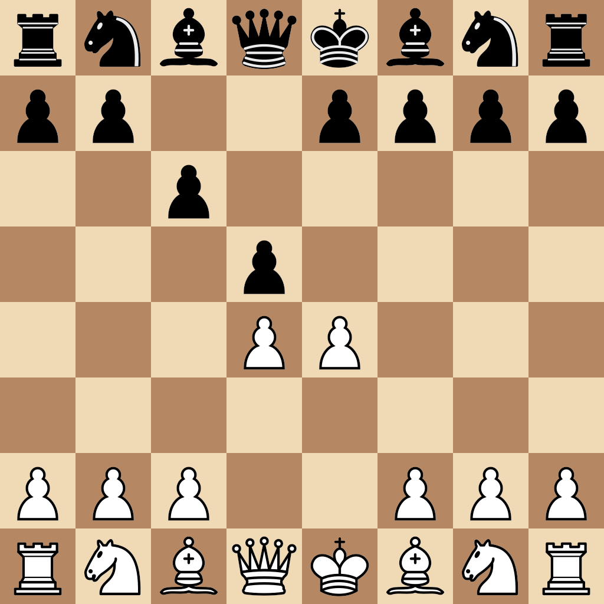

# fen
Outputs a picture of a chess position given its [FEN](https://en.wikipedia.org/wiki/Forsyth%E2%80%93Edwards_Notation) string

## Requirements
- python3.x
- PIL `(pip install pillow)`
## Usage
`python fen.py [FEN]`
This will output `output.png` representing the position in the root folder

## Examples
### Caro-Kann
`python fen.py "rnbqkbnr/pp2pppp/2p5/3p4/3PP3/8/PPP2PPP/RNBQKBNR w KQkq - 0 3"` \
